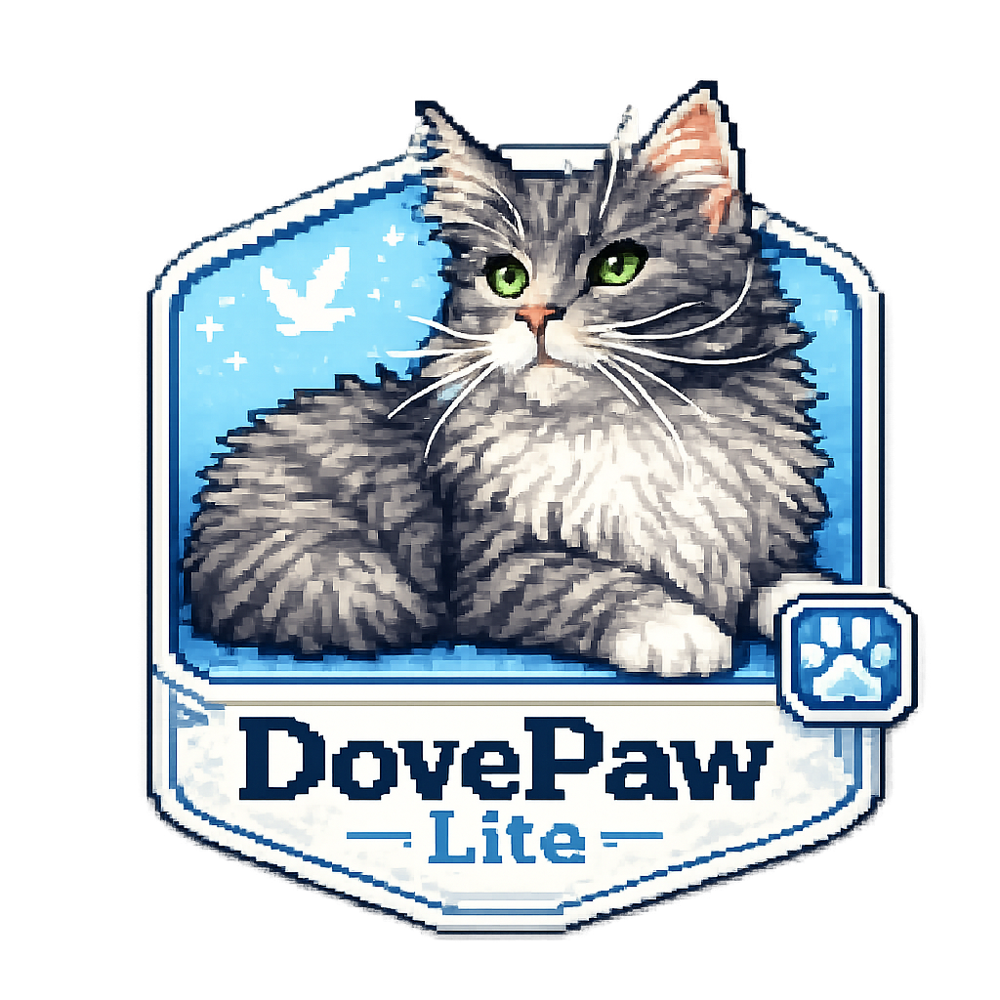
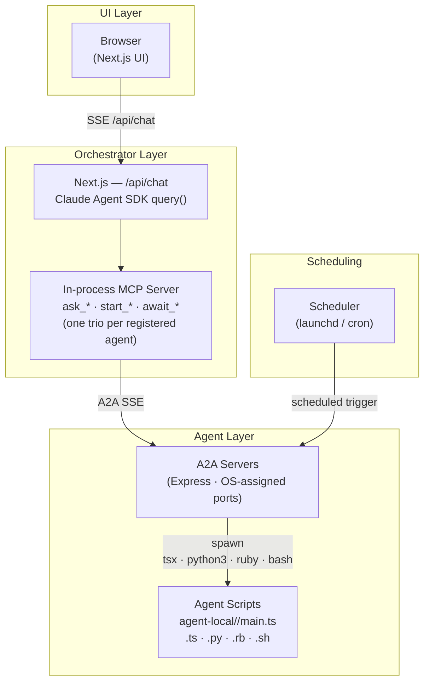
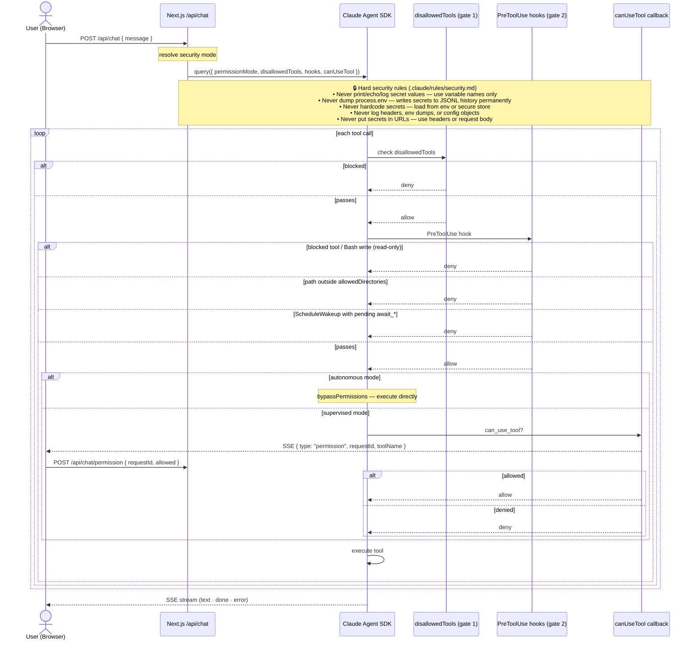

<p align="center">
  
</p>

<p align="center">
  <a href="https://www.typescriptlang.org/"></a>
  <a href="https://nodejs.org/"></a>
  <a href="https://nextjs.org/"></a>
  <a href="https://www.npmjs.com/package/@anthropic-ai/claude-agent-sdk"></a>
  <a href="https://www.npmjs.com/package/@openai/codex-sdk"></a>
  <a href="https://a2a-protocol.org/"></a>
  <a href="https://github.com/PixelPaw-Labs/DovePaw-Lite/actions/workflows/ci.yml"></a>
  <a href="https://vitest.dev/"></a>
  <a href=".github/dependabot.yml"></a>
</p>

# DovePaw

Multi-agent orchestration runtime built on the [Claude Agent SDK](https://www.npmjs.com/package/@anthropic-ai/claude-agent-sdk). Drop agent scripts into `agent-local/`, run `npm run dev`, and a Dove chatbot immediately surfaces them as conversational tools — no config, no hardcoded ports. Scripts can be TypeScript (`.ts`), Python (`.py`), Ruby (`.rb`), or shell (`.sh`). Schedule agents via macOS launchd or Linux cron, or deploy to ECS with S3-backed config.

<p align="center">
  
</p>

---

## Claude Code Agent SDK

Dove is built on the [`@anthropic-ai/claude-agent-sdk`](https://www.npmjs.com/package/@anthropic-ai/claude-agent-sdk) — the same runtime that powers Claude Code itself.

The SDK's `query()` function runs Dove as a stateful agent loop. It handles the Claude API calls, tool dispatch, and — critically — **conversation memory**. There is no database for chat history in this project. Conversation continuity is entirely managed by the SDK: each turn passes `resume: sessionId` to `query()`, which replays the session from the SDK's own storage under `~/.claude/projects/`. The in-memory store (`db-lite.ts`) only tracks lightweight UI metadata (session status, progress labels) — not message content.

```typescript
// chatbot/app/api/chat/route.ts — simplified
query({
  prompt: message,
  options: {
    // Resume picks up the full conversation history from ~/.claude/projects/
    ...(sessionId ? { resume: sessionId } : {}),
    mcpServers: { agents: mcpServer }, // inject ask_*/start_*/await_* tools
    systemPrompt: { type: "preset", preset: "claude_code", append: buildSystemPrompt() },
  },
});
```

The SDK also provides the `tool()` factory used to define each agent's MCP tools, and the `hooks` / `canUseTool` callbacks used to gate permissions and stream progress to the browser.

**What this means in practice:** conversation history survives process restarts (it lives in `~/.claude/`), but is tied to the machine. For server deployments where the container is ephemeral, each restart begins a fresh conversation. If you need persistent cross-restart history, add a session export step before container shutdown.

---

## Architecture



### How it flows

1. **Browser → Dove.** The user sends a message to the Next.js chat UI. Dove is a Claude Agent SDK `query()` session that receives the message and a set of MCP tools — one trio (`ask_*`, `start_*`, `await_*`) per registered agent.

2. **Dove → A2A server.** When Dove decides to invoke an agent, it calls one of its MCP tools. The tool sends an A2A message to that agent's Express server over SSE. Ports are OS-assigned at startup and published to `~/.dovepaw-lite/.ports.<port>.json` — no hardcoded ports.

3. **A2A server → agent script.** The A2A server spawns the agent script using a runtime determined by its file extension (`.ts` → `tsx`, `.py` → `python3`, `.rb` → `ruby`, `.sh` → `bash`). The script receives the instruction as `argv[1]` (or `process.argv[2]` in Node), runs its logic, and returns output. The server streams the result back up through the A2A protocol to Dove, then to the browser as SSE events.

4. **Scheduling.** Agents with a `schedule` field in their `agent.json` can be installed as cron jobs (Linux) or launchd daemons (macOS) via `npm run install`. The scheduler fires the A2A trigger script on the configured interval. No schedule = on-demand only.

### Key design decisions

| Decision                               | Reason                                                                                                        |
| -------------------------------------- | ------------------------------------------------------------------------------------------------------------- |
| In-memory session store                | Conversation memory lives in the Claude Code SDK (`~/.claude/`), not a DB — the store only tracks UI metadata |
| `agent-local/` scanned at startup      | Agent discovery is a directory scan — add a folder, restart, it appears                                       |
| OS-assigned A2A ports                  | No port conflicts, no config to maintain                                                                      |
| Platform-neutral scheduler abstraction | `lib/scheduler.ts` adapts to launchd (macOS) or cron (Linux)                                                  |

---

## Repo Layout

```
agent-local/              ← your agent scripts live here
  hello-world/
    agent.json            ← agent metadata: name, icon, schedule, MCP description
    main.ts               ← agent entry point (default; .py / .rb / .sh also supported)

chatbot/
  app/                    ← Next.js pages and API routes
  a2a/                    ← A2A Express servers (one per agent)
  lib/                    ← shared chatbot utilities, session store, hooks

lib/                      ← shared library: agents, scheduler, settings, paths
packages/agent-sdk/       ← shared agent utilities (Claude/Codex runners, git, logger)

scripts/
  chatbot-start.ts        ← starts A2A servers + Next.js dev server
```

---

## Getting Started

> **Full walkthrough:** see [docs/getting-started.md](docs/getting-started.md) for a step-by-step guide with UI screenshots.

**Prerequisites:** Node.js 20+, Claude Code CLI authenticated (or `ANTHROPIC_API_KEY` set).

```bash
npm install
npm run dev        # starts A2A servers + Next.js on an available port
```

Open the URL printed by Next.js. Dove appears in the sidebar. The `hello-world` agent is already registered — send it a message to verify the stack is working.

---

## Docker (local)

**Prerequisites:** Docker Desktop, [`ejson`](https://github.com/Shopify/ejson) (`brew install ejson`).

**1. Create and encrypt a secrets file**

```bash
# Generate a keypair — private key saved to ~/.ejson/keys/<pubkey>
ejson keygen

# Copy the example and fill in your public key + API key
cp secrets.ejson.example secrets.ejson
# Edit secrets.ejson: set "_public_key" and plaintext "ANTHROPIC_API_KEY"

ejson encrypt secrets.ejson   # encrypts in place — safe to commit
```

**2. Build and run**

```bash
docker compose build
docker compose up
```

Open `http://localhost:8473`. Dove is running inside the container using the same agents baked into the image.

**Volumes**

| Volume            | Path in container | Contents                                              |
| ----------------- | ----------------- | ----------------------------------------------------- |
| `dovepaw-data`    | `/data`           | Agent settings, port manifests, workspaces, SQLite DB |
| `claude-sessions` | `/root/.claude`   | Claude Agent SDK session history                      |

Agent scripts and settings are baked into the image at build time. To add or edit agents, rebuild with `docker compose build`.

---

## Adding an Agent

> **Quickstart:** In Claude Code, run `/sub-agent-builder` to scaffold a new agent interactively — it handles file creation, registration, and skill setup end-to-end.

To add an agent manually:

1. Create a directory under `agent-local/`:

```
agent-local/my-agent/
  agent.json
  main.ts        ← default entry; set "scriptFile" in agent.json to use .py / .rb / .sh
```

2. **`agent.json`** — required fields:

```json
{
  "version": 1,
  "name": "my-agent",
  "alias": "ma",
  "displayName": "My Agent",
  "description": "What this agent does — shown to Dove as the MCP tool description.",
  "iconName": "Bot",
  "scriptFile": "main.ts",
  "schedulingEnabled": false,
  "locked": false,
  "doveCard": {
    "title": "My Agent",
    "description": "Short description for the Dove card grid",
    "prompt": "What does My Agent do?"
  },
  "suggestions": [
    {
      "title": "Run it",
      "description": "Trigger the agent",
      "prompt": "Run my agent now"
    }
  ],
  "repos": [],
  "envVars": []
}
```

3. **Entry script** (`main.ts` by default, or whatever `scriptFile` points to) — receives the user's instruction as the first argument (`process.argv[2]` in TypeScript/Node, `sys.argv[1]` in Python, `$1` in shell):

```typescript
import { createLogger } from "@dovepaw/agent-sdk";

const log = createLogger("my-agent");
const instruction = process.argv[2] ?? "no instruction";

log.info(`Running with: ${instruction}`);
// your logic here
console.log("Done.");
```

4. Restart `npm run dev` — the agent appears in the Dove sidebar automatically.

### Scheduling an agent

Add a `schedule` field to `agent.json` and set `schedulingEnabled: true`:

```json
"schedulingEnabled": true,
"schedule": { "type": "calendar", "hour": 9, "minute": 0 }
```

Then run `npm run install` to generate and activate the scheduler config. The agent will fire daily at 09:00 via launchd (macOS) or cron (Linux).

### Environment variables

Per-agent env vars are declared in `agent.json` under `envVars`:

```json
"envVars": [
  { "key": "MY_API_KEY", "value": "" }
]
```

Fill in values through the Settings UI (Settings → agent name → Env Vars tab). Values are stored in `~/.dovepaw-lite/settings.agents/<name>/agent.json` outside the repo.

---

## Configuration

All runtime state lives outside the repo under `~/.dovepaw-lite/` (override with `DOVEPAW_DATA_DIR` env var for server deployments):

| Path                                                | Contents                                                    |
| --------------------------------------------------- | ----------------------------------------------------------- |
| `~/.dovepaw-lite/settings.json`                     | global settings: repositories, Dove persona, env vars       |
| `~/.dovepaw-lite/settings.agents/<name>/agent.json` | per-agent repos, env vars, schedule                         |
| `~/.dovepaw-lite/workspaces/`                       | isolated execution workspace roots                          |
| `~/.dovepaw-lite/agents/state/`                     | persistent per-agent state                                  |
| `~/.dovepaw-lite/agents/logs/`                      | per-agent log files                                         |
| `~/.dovepaw-lite/cron/`                             | compiled scheduler scripts (generated by `npm run install`) |

### Server / ECS deployment

Set `S3_CONFIG_BUCKET` to enable S3 write-through for all JSON config writes. On container startup, pull config before starting the app:

```bash
aws s3 sync s3://$S3_CONFIG_BUCKET/ ${DOVEPAW_DATA_DIR:-~/.dovepaw-lite}/
npm run dev
```

**ECS env vars:**

| Env var             | Required         | Description                                                         |
| ------------------- | ---------------- | ------------------------------------------------------------------- |
| `S3_CONFIG_BUCKET`  | Optional         | S3 bucket name — activates write-through; unset = local mode only   |
| `DOVEPAW_DATA_DIR`  | Optional         | Override data dir (default: `~/.dovepaw-lite/`)                     |
| `AWS_REGION`        | When S3 used     | AWS region for the S3 client                                        |
| `ANTHROPIC_API_KEY` | Required         | Claude API key passed to the Claude Code CLI subprocess             |
| `CLAUDE_CLI_PATH`   | Optional         | Path to the Claude Code CLI binary (default: `~/.local/bin/claude`) |
| `OPENAI_API_KEY`    | When using Codex | Required if `AGENT_SCRIPT_MODEL` is a GPT/Codex model               |

---

## Chat API

The chat API is a plain HTTP SSE endpoint. Any frontend — Slack bot, CLI, mobile app — can talk to Dove without going through the Next.js UI.

### Endpoints

| Method   | Path        | Purpose                              |
| -------- | ----------- | ------------------------------------ |
| `POST`   | `/api/chat` | Send a message, receive SSE stream   |
| `PATCH`  | `/api/chat` | Stop the current turn (keep session) |
| `DELETE` | `/api/chat` | Stop and optionally delete a session |

### POST /api/chat

**Request body** (`application/json`):

```json
{ "message": "Run the hello-world agent", "sessionId": null }
```

- `message` — the user's text
- `sessionId` — `null` on the first message; the value from the `session` event on every subsequent message in the same conversation

**Response:** `text/event-stream`. Each event is a line of the form:

```
data: <JSON>\n\n
```

Parse each line by stripping the `data: ` prefix and JSON-parsing the remainder.

### SSE event types

| `type`       | Payload                                      | Action                                                                                           |
| ------------ | -------------------------------------------- | ------------------------------------------------------------------------------------------------ |
| `session`    | `{ sessionId: string }`                      | **Save this.** Pass it as `sessionId` on every subsequent turn to resume the conversation.       |
| `text`       | `{ content: string }`                        | Append to the response buffer — Dove's reply arrives as incremental deltas.                      |
| `thinking`   | `{ content: string }`                        | Extended thinking delta — show or ignore.                                                        |
| `tool_call`  | `{ name: string }`                           | Dove invoked a tool — informational.                                                             |
| `tool_input` | `{ content: string }`                        | Tool arguments JSON — informational.                                                             |
| `result`     | `{ content: string }`                        | Full response text, emitted when no `text` deltas were sent. Use as fallback.                    |
| `progress`   | `{ result: { output, progress } }`           | Agent task progress — workflow step labels from a downstream agent.                              |
| `done`       | —                                            | Stream complete. Flush the response buffer.                                                      |
| `cancelled`  | —                                            | User stopped the turn.                                                                           |
| `error`      | `{ content: string }`                        | Query failed.                                                                                    |
| `permission` | `{ requestId, toolName, toolInput, title? }` | Dove needs user approval to use a tool. POST `{ requestId, allowed }` to `/api/chat/permission`. |
| `question`   | `{ requestId, questions }`                   | Dove is asking clarifying questions. POST `{ requestId, answers }` to `/api/chat/question`.      |

### Stop or delete a session

```bash
# Stop the current turn (subprocess exits, session row kept for resume)
curl -X PATCH http://localhost:3000/api/chat \
  -H "Content-Type: application/json" \
  -d '{"sessionId":"<id>"}'

# Delete a session entirely
curl -X DELETE http://localhost:3000/api/chat \
  -H "Content-Type: application/json" \
  -d '{"sessionId":"<id>","method":"delete"}'
```

### JavaScript example (multi-turn)

```typescript
async function chat(baseUrl: string, message: string, sessionId: string | null) {
  const res = await fetch(`${baseUrl}/api/chat`, {
    method: "POST",
    headers: { "Content-Type": "application/json" },
    body: JSON.stringify({ message, sessionId }),
  });

  let text = "";
  let nextSessionId: string | null = null;
  const reader = res.body!.getReader();
  const decoder = new TextDecoder();
  let buffer = "";

  while (true) {
    const { done, value } = await reader.read();
    if (done) break;
    buffer += decoder.decode(value, { stream: true });

    for (const line of buffer.split("\n\n")) {
      if (!line.startsWith("data: ")) continue;
      const event = JSON.parse(line.slice(6));

      if (event.type === "session") nextSessionId = event.sessionId;
      else if (event.type === "text") text += event.content;
      else if (event.type === "result" && !text) text = event.content;
      else if (event.type === "done") break;
      else if (event.type === "error") throw new Error(event.content);
    }
    buffer = buffer.endsWith("\n\n") ? "" : (buffer.split("\n\n").at(-1) ?? "");
  }

  return { text, sessionId: nextSessionId };
}

// First turn — no sessionId
const turn1 = await chat("http://localhost:3000", "Hello Dove!", null);
console.log(turn1.text);

// Second turn — resume the same conversation
const turn2 = await chat("http://localhost:3000", "What agents do you have?", turn1.sessionId);
console.log(turn2.text);
```

### Python example

```python
import httpx, json

def chat(base_url: str, message: str, session_id: str | None):
    text, next_session_id = "", None
    with httpx.stream("POST", f"{base_url}/api/chat",
                      json={"message": message, "sessionId": session_id},
                      timeout=None) as r:
        buffer = ""
        for chunk in r.iter_text():
            buffer += chunk
            while "\n\n" in buffer:
                block, buffer = buffer.split("\n\n", 1)
                if not block.startswith("data: "):
                    continue
                event = json.loads(block[6:])
                if event["type"] == "session":
                    next_session_id = event["sessionId"]
                elif event["type"] == "text":
                    text += event["content"]
                elif event["type"] == "result" and not text:
                    text = event["content"]
                elif event["type"] in ("done", "cancelled"):
                    break
                elif event["type"] == "error":
                    raise RuntimeError(event["content"])
    return text, next_session_id

# First turn
reply, sid = chat("http://localhost:3000", "Hello Dove!", None)
print(reply)

# Second turn — resume
reply, sid = chat("http://localhost:3000", "What agents do you have?", sid)
print(reply)
```

### Notes for server deployments

- The SSE stream can stay open for up to 24 hours (`maxDuration = 86400`) — set your proxy or load balancer timeout accordingly.
- A `PATCH /api/chat` stop leaves the Claude subprocess running in the background; the conversation can still be resumed. `DELETE` with `method: "delete"` cleans it up entirely.
- When the client disconnects mid-stream, the subprocess keeps running. This is intentional — long-running agents finish their work even if the Slack bot connection drops. Resume with the saved `sessionId` when reconnecting.
- Each `sessionId` is a UUID. Conversation history (full message content) is stored by the Claude Agent SDK in `~/.claude/projects/` on the server — not in the in-memory store. The in-memory store only holds session status and progress metadata, which is lost on server restart.

---

## Security

### Dove Mode

Dove operates in one of three modes, configured in Settings → Dove:

| Mode                       | SDK permission mode | Effect                                                                                                                                                                       |
| -------------------------- | ------------------- | ---------------------------------------------------------------------------------------------------------------------------------------------------------------------------- |
| **read-only**              | `default`           | Blocks all write tools via SDK `disallowedTools` + PreToolUse hooks. Write-capable Bash patterns (redirects, `rm`, `mv`, interpreters) are caught by a secondary regex gate. |
| **supervised** _(default)_ | `acceptEdits`       | File edits are auto-approved; Bash commands and other tool calls prompt the user in the browser before executing.                                                            |
| **autonomous**             | `bypassPermissions` | All tool use is auto-approved. Suitable for fully-trusted local use only.                                                                                                    |

### Permission flow



### PreToolUse hooks (enforcement layer)

PreToolUse hooks run inside the SDK's tool-dispatch loop and act as a second gate independent of the SDK's own permission model.

**Read-only enforcement.** When Dove mode is `read-only`, the hooks block every tool on the `disallowedTools` list (e.g. `Write`, `Edit`, `TodoWrite`, `CronCreate`) and inspect every `Bash` call for write patterns (output redirects `>`, `sed -i`, destructive commands). A tool that reaches the hook and matches is denied with an explanatory reason — it cannot be bypassed by the agent.

**Directory restriction.** Both Dove and each agent sub-process are given an `allowedDirectories` list (Dove: the project `cwd` plus any additional directories it needs; sub-agents: the workspace path plus the agent source and persistent state directories). Any `Edit`, `Write`, `NotebookEdit`, or `Bash` write call targeting a path outside that list is denied by a PreToolUse hook before the file is touched:

```
"<resolved_path>" is outside the allowed directories: /tmp/workspaces/.my-agent/...
You should stop and reconsider if you really need to access this path.
```

The agent is instructed to ask the user for explicit permission before retrying.

**ScheduleWakeup guard.** A hook blocks `ScheduleWakeup` while any `await_*` tool call is pending, preventing agents from scheduling a wake-up to defer polling.

### Interactive permissions (`canUseTool`)

In `supervised` mode, Dove uses a `canUseTool` callback instead of auto-approving everything. When a tool call needs approval, the server sends a `permission` SSE event to the browser:

```json
{
  "type": "permission",
  "requestId": "...",
  "toolName": "Bash",
  "toolInput": { "command": "..." },
  "title": "..."
}
```

The user approves or denies via `POST /api/chat/permission`:

```json
{ "requestId": "...", "allowed": true }
```

Until the user responds, the agent is paused. If the browser disconnects, pending permissions are aborted and the agent stops waiting.

### Sub-agent isolation

Agents launched by Dove run as SDK sub-agents (`permissionMode: "acceptEdits"`) with:

- An isolated workspace directory (under `~/.dovepaw-lite/workspaces/`)
- A scoped `allowedDirectories` list enforced by PreToolUse hooks
- A fixed `allowedTools` list — only the `start_<name>` and `await_<name>` MCP tools are available; no arbitrary tool expansion

---

## Contributing

1. Fork the repo and create a branch from `main`.
2. Add or update tests for any changed behaviour.
3. Run `npm run lint && npm test` and ensure both pass.
4. Open a pull request — describe what changed and why.
