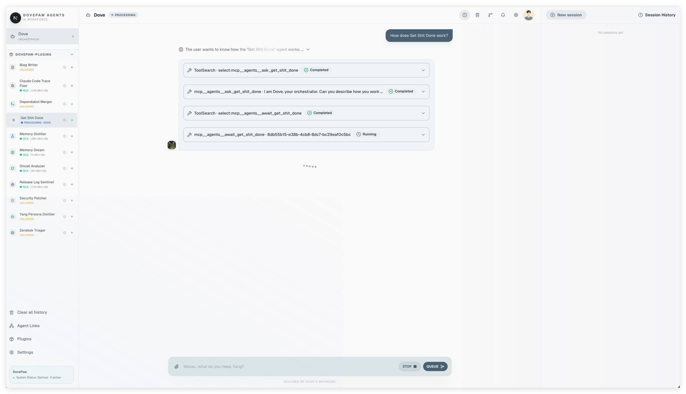

# DovePaw


## Why I Built This

> Full story on Medium: [Building DovePaw — A Personal Engineering Blog Series](https://medium.com/@ywian/building-dovepaw-a-personal-engineering-blog-series-3634f3185b90)

I use Claude Code daily. Probably 6–8 hours a day.

But there's a category of work that drains me — the repeat, low-creative stuff. Writing docs. Triaging Dependabot PRs. Patching security alerts. The kind of tasks where the answer is obvious but someone still has to do it.

My first instinct was the open-source community. Claude Code commands, skills, agents — people have built a lot. I tried OpenClaw. But here's where it gets tricky: security is a real concern. I only want to run agents I can read. I want to know exactly what they do before they touch my repos.

So I built my own.

I started small — a skill chain, or maybe skill orchestrator is the better name. Then I needed the agents to run without me. So I wired the Claude Agent SDK to macOS launchd daemons. A fleet of agents now running in the background. Scheduled. Autonomous. Mine.

But I am a bit lazy to maintain what I built….

The plist files. The compiled scripts. The agent configs scattered under `~/.dovepaw/`. After a few months, I lost the trace on which artifact came from where, what was safe to edit, what would get wiped on the next reinstall.

I noticed a pain → I wanted something simple → So I built it. Again.

Early 2026. A colleague posted in Slack: "I want to build a /implement `<jira-url>` skill."

I already had something like that running. A /implement command that composed its context by reading other commands into XML tags — a trick I had documented in a Medium post. It felt clever. It also had some cracks.

That Slack thread was the spark. It surfaced that other engineers wanted the same thing, pushed me to share publicly, and kicked off the next round of iteration.

I didn't know that iteration would end with me building my own agent orchestrator named after my cat.

DovePaw is a personal agent system built on top of the Claude Code harness. It doesn't sit beside Claude Code — it lives inside it, extending the harness environment with launchd daemons, MCP tools, the A2A protocol, and custom skills. At the centre of it is Dove: an orchestrator agent, also running on top of Claude Code, that can invoke, coordinate, or hand off to any of the background agents. The whole thing is wired together through the same environment Claude Code already runs in, which means the infrastructure is real — persistent, schedulable, composable — not just a wrapper around a chat API.

This is the story of that build — and what I learned about maintaining the thing that maintains everything else.

---

## Architecture — The Part That Runs Itself

The design I landed on has one rule: **edit source, run install, everything else regenerates.**

```
Browser UI (Next.js :7473)
  ↓ SSE
Dove — orchestrator agent (Claude Code + MCP server)
  ↓ ask_* / start_* / await_* tools
A2A Servers — one Express process per agent (OS-assigned ports)
  ↓ spawn tsx
Agent Scripts — from installed plugin repos, run as launchd daemons
```

Three things make this low-maintenance:

**Build artifacts are throw-away.** The `.mjs` daemon scripts and `.plist` files under `~/.dovepaw/cron/` are generated on every `npm run install`. Never edit them directly — they get wiped. The source of truth is always `agent.json` and the TypeScript in the plugin repo.

**Agents are plugins, not hardcoded.** Each agent lives in its own plugin repo with a `dovepaw-plugin.json` manifest. DovePaw clones the repo into `~/.dovepaw/plugins/`, reads the manifest, and wires everything up at startup. Adding or removing an agent is just install or uninstall — no changes to DovePaw itself.

**Ports and registry are dynamic.** A2A servers bind to OS-assigned ports at startup and publish a port manifest to `~/.dovepaw/`. Dove polls that manifest — no hardcoded ports, no manual wiring when agents restart.

The only things that need ongoing maintenance are the agent scripts themselves — the actual logic inside each plugin repo. Everything else regenerates from a single command.

---

## What Kind of Agents Run Here

Not skills. Skills are a single prompt file — stateless, one-shot, good for a bounded task.

DovePaw is for agents that are too complex for that. The kind where you need to:

- fetch data from an API, parse it, decide what to do next
- loop over a list of repos deterministically, spawn a Claude subprocess per item
- coordinate across multiple steps where some are code and some are reasoning
- handle failures, retries, and state between runs

The pattern I landed on: **write the scaffolding in TypeScript, leave the core work to Claude CLI.**

The TypeScript handles the deterministic parts — which repos to touch, what data to fetch, how to structure the prompt, when to retry. Claude CLI handles everything else — reading code, making judgements, writing files, opening PRs, getting things done. The two layers stay separate. You don't ask Claude to loop over a list. You loop over the list in code and ask Claude once per item.

And because each Claude invocation is itself a full Claude Code session, an agent script can spawn sub-agents — each with their own tools, context, and instructions. One agent orchestrates several. Those agents can orchestrate more. I call it an infinite agent chain (:joy:). In practice it means a single chatbot message can fan out into a coordinated fleet of Claude processes working across multiple repos simultaneously, each one focused, each one isolated.

This keeps agents predictable. The scaffolding is testable. The Claude invocations are isolated. And when something breaks, you know which layer to debug.

### Anatomy of an Agent Script

Each agent is a single `main.ts` file. They all follow the same shape:

```
Configuration   — read env vars, resolve paths, create logger
buildPrompt()   — construct what Claude CLI receives (may compose a skill invocation)
main()          — orchestrate: gather data → call spawnClaudeWithSignals() → handle output
```

`spawnClaudeWithSignals()` from `@dovepaw/agent-sdk` is the Claude CLI invocation. That's the only place Claude runs. Everything before it is TypeScript.

Agents are dual-mode. When the chatbot triggers one, the user's instruction arrives as `process.argv[2]` and the agent acts on it directly. When launchd fires the schedule with no argument, the agent runs in batch mode across all configured repos. Same script, two entry points.


---

## Settings — Global and Per-Agent

Two levels of config, both under `~/.dovepaw/`:

**Global** (`settings.json`) — shared across all agents: repository list, API keys, global feature flags. Edit once, all agents pick it up on next run.

**Per-agent** (`settings.agents/<name>/agent.json`) — schedule (cron expression), env vars injected at daemon install time, which repos the agent has access to, the agent's MCP description and icon. Each agent owns its own slice.

The separation matters: global settings are for things every agent needs to know. Per-agent settings are for things only that agent should care about. Mixing them is how you end up with a config file no one understands six months later.

---

## Agent Links

Agents can be wired together. An agent link declares a directional connection — agent A can invoke agent B — and is stored in `~/.dovepaw/agent-links.json`.

Dove, the orchestrator, uses these links to know which agents it can hand off to. Connectivity is gated on heartbeat — if an agent's A2A server isn't running, Dove won't try to route to it. No silent failures.

This is how I chain work across agents: one agent surfaces findings, another acts on them, a third reports back. Each agent stays focused on one thing. The links define the flow.

---

## Talking to Dove and the Agents



There are two ways to interact.

**Through Dove** — the orchestrator. Open the chatbot UI at `localhost:7473` and talk to Dove directly. Dove knows all the installed agents, their capabilities, and the links between them. You can ask Dove to kick off a task and it will route to the right agent, fire-and-forget or wait for the result, and report back. You don't need to know which agent does what — that's Dove's job.

**Directly to an agent** — each agent also exposes its own chat interface. If you know exactly which agent you want, you can open its conversation and talk to it without going through Dove. Useful when you want to inspect state, re-run a specific job, or debug what an agent is doing.

Both surfaces are in the same browser UI. Dove is just the one that coordinates the rest.

---

## Installing Agents From Your Own Repos

Plugin repos can be public or private. If your agent code touches private infrastructure — internal APIs, private repos, proprietary tooling — you probably don't want it in a public repo. I don't either.

Install from any git URL you have access to:

```bash
# GitHub slug — uses gh CLI
npm run plugin:add owner/my-agents

# full git URL — any remote git clone understands
npm run plugin:add https://github.com/owner/private-agents

# local path — useful during development
npm run plugin:add ../my-agents
```

DovePaw clones the repo into `~/.dovepaw/plugins/` using your existing git auth. SSH keys, GitHub CLI auth, HTTPS tokens — whatever you already have configured locally. Nothing extra to set up.

This is the reason I built the plugin system this way. My agents are in private repos. The ones that touch work infrastructure especially. I can install them on any machine I own, update them with a git pull, and nothing about the sensitive parts ever leaves my control.

---

## Getting Started

> **macOS only.** DovePaw uses launchd for daemon scheduling and an Electron menubar app to keep the A2A servers alive. Linux and Windows are not supported.

> **Prerequisites.** Dove and all agent scripts invoke Claude under the hood. You need either an Anthropic API key (`ANTHROPIC_API_KEY`) or the Claude Code CLI installed and authenticated on your machine. Without one of these, nothing runs.

**First time setup:**

```bash
npm install
npm run install    # builds codebase, generates plists, registers launchd daemons, links skills
npm run electron:dev
```

**Day-to-day:**

```bash
npm run electron:dev
```

That's it. `electron:dev` compiles the Electron shell, launches the `DovePawA2A` menubar app in the background, and starts the A2A servers and the chatbot UI. Everything runs under the Electron process — kill it and the servers go down with it.

`npm run install` is only needed on first setup or after adding/removing agents — it's what generates the launchd plists and links skills into `~/.claude/skills/`.

Click the menubar icon to open Dove.

---

**Adding an agent:**

DovePaw ships with a built-in skill `/sub-agent-builder` that scaffolds a new agent end-to-end from a single description. It generates the `agent.json`, `main.ts`, and plugin manifest — you describe what the agent should do, it wires the boilerplate. You write the logic.

Once your plugin repo is ready:

```bash
npm run plugin:add owner/my-agents    # install plugin
npm run install                        # regenerate plists and redeploy
npm run electron:dev                   # restart to pick up new agents
```

Agent configs live in `~/.dovepaw/settings.agents/<name>/agent.json`. Plugin repos install into `~/.dovepaw/plugins/`. State and logs under `~/.dovepaw/agents/`.

If something breaks: read the source, not the artifacts. The artifacts are generated.

---

## If You Find This Interesting

This is a personal project — built on nights and weekends, shaped by real problems I wanted to stop doing manually. Not a framework, not a product. Just something that works well for me.

If it sparks ideas for your own setup, feel free to fork it and adapt it. The plugin system is designed for that — your agents, your repos, your rules.

And if you find it useful, a ⭐ goes a long way. It tells me the time I put into this is worth continuing.

Even if this ends up being useful only to a handful of engineers with the same lazy streak, that's enough.
