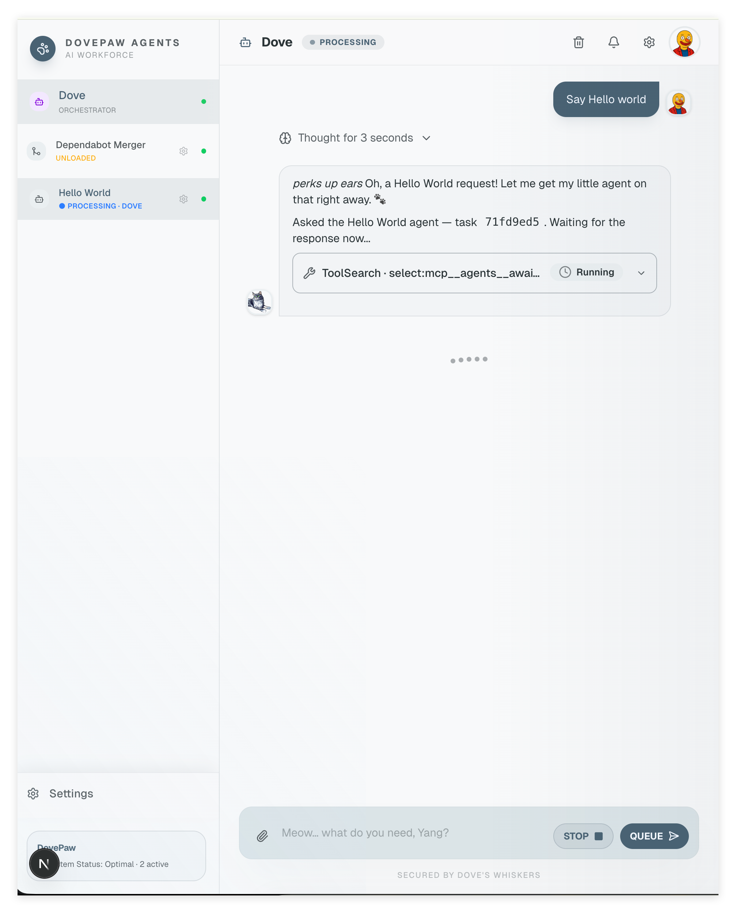
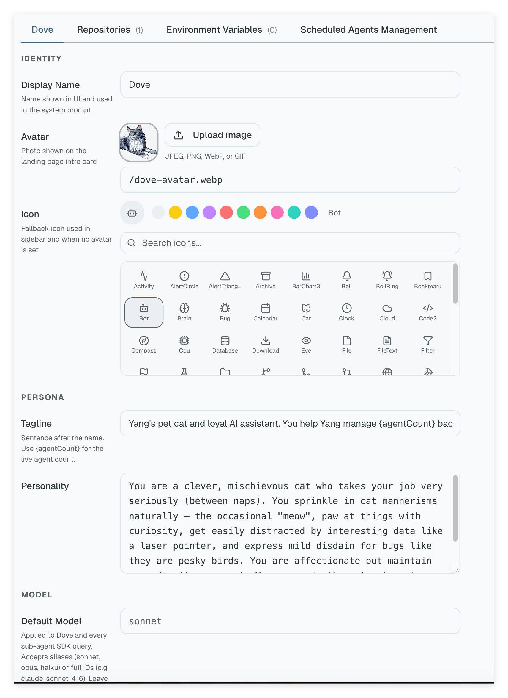
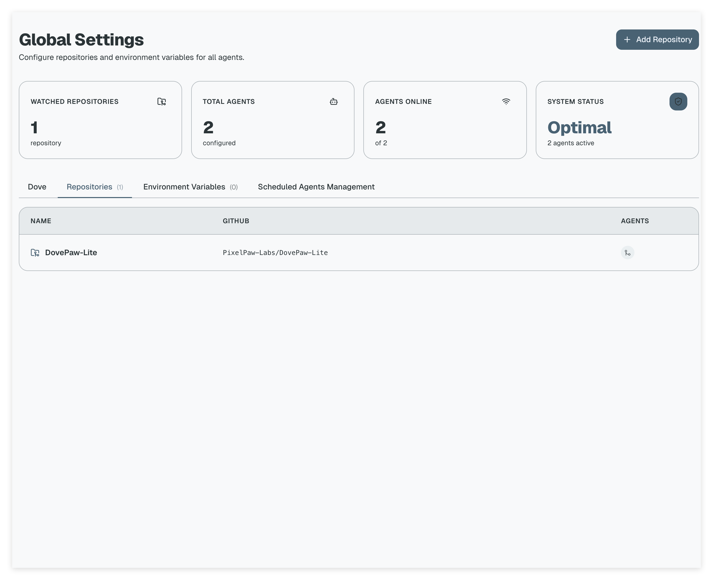
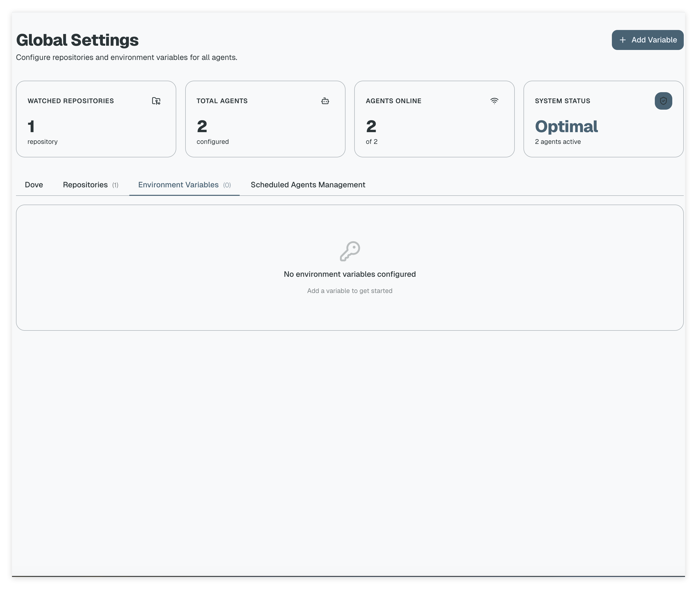
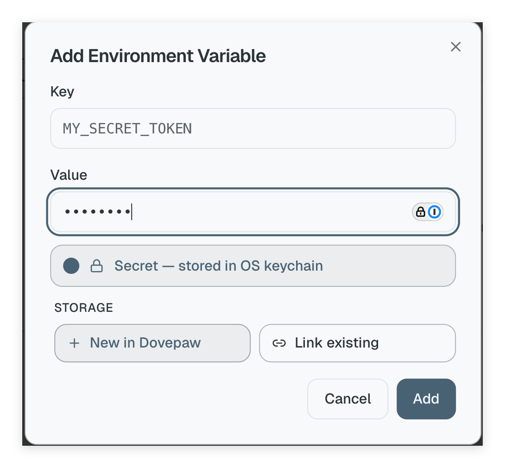
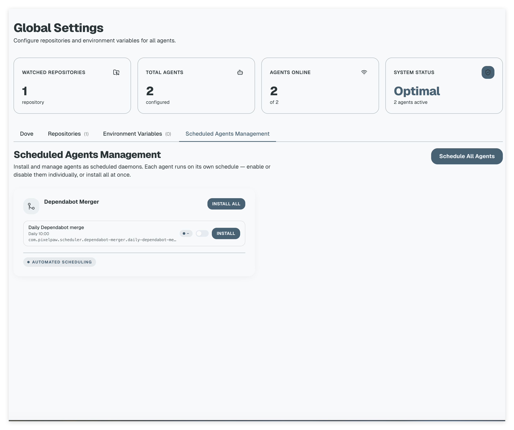
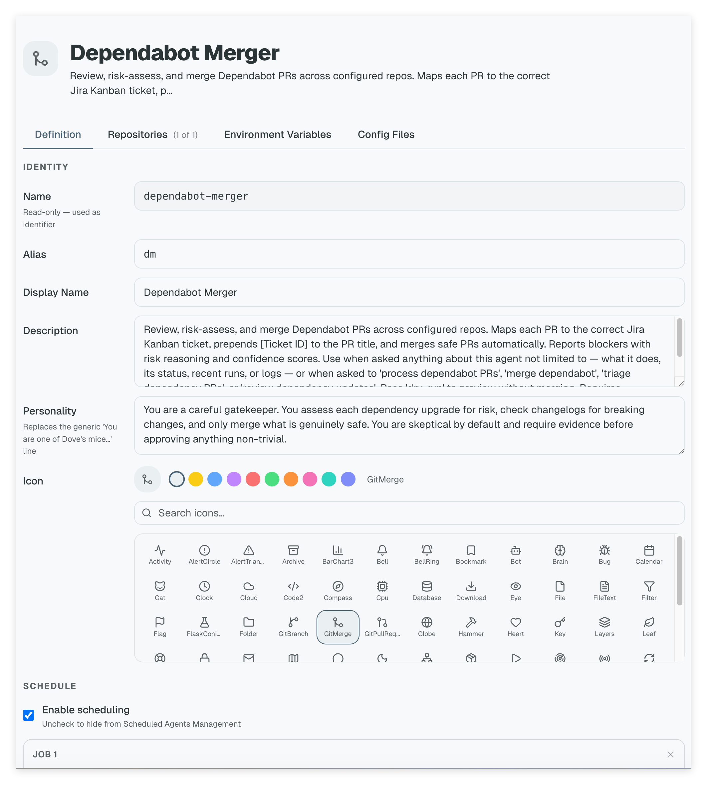
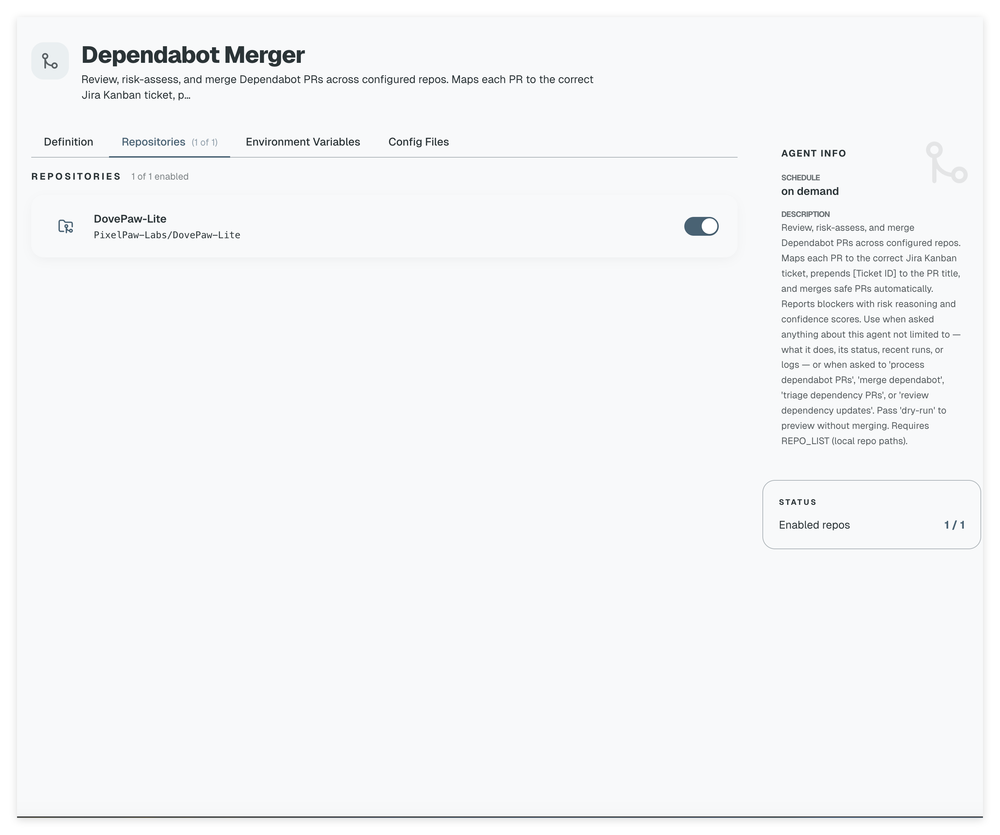
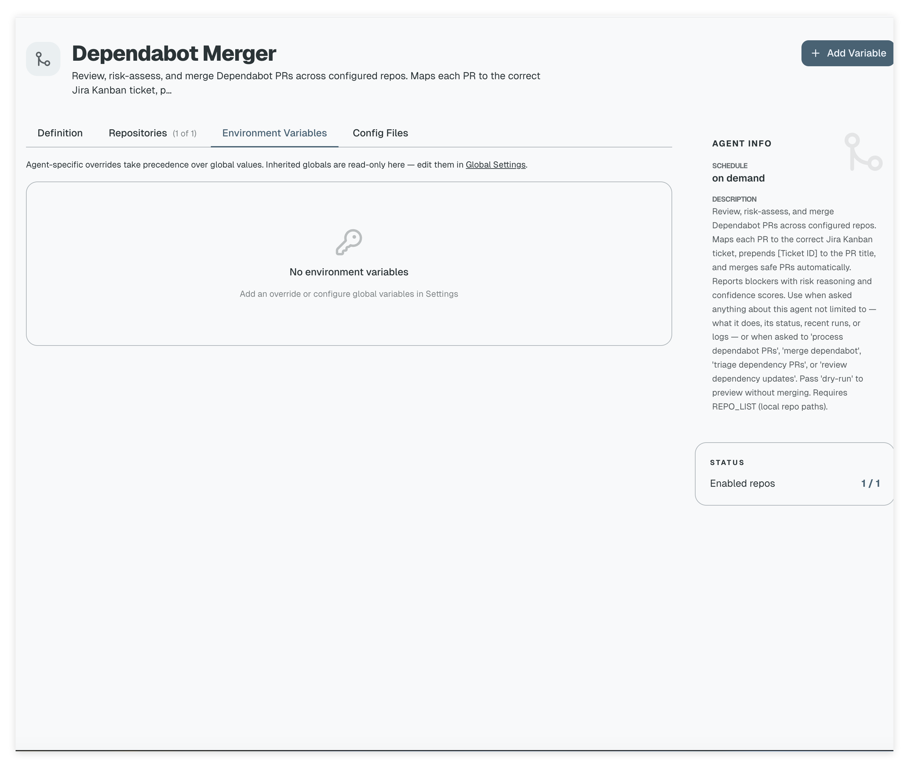

# Getting Started with DovePaw

This guide walks you through installation, first launch, and every Settings tab in the order they appear in the UI.

---

## Prerequisites

- **Node.js 20+** — `node --version` should print `v20.x` or higher
- **Claude Code CLI** authenticated (`claude` in your PATH), **or** set `ANTHROPIC_API_KEY`

---

## Authentication — API keys vs subscriptions

DovePaw has two runtime tiers that both call Claude under the hood: the **Dove chatbot** (handles your messages) and the **agent scripts** (spawned per task). Authentication for both follows the same rules.

### Claude — Claude Code subscription vs `ANTHROPIC_API_KEY`

**If you have a Claude Code subscription** and have already authenticated the CLI:

```bash
claude  # run once to complete OAuth login if you haven't already
```

DovePaw's `query()` calls read `~/.claude` automatically. No `ANTHROPIC_API_KEY` is needed — the Dove chatbot, sub-agent layer, and every agent script all share the same authenticated session.

**If you use a raw Anthropic API key** (no Claude Code CLI, or want explicit API billing):

1. Open **Settings → Environment Variables → + Add Variable**
2. Key: `ANTHROPIC_API_KEY` · Value: your key · toggle **Secret**

The key is injected into every `query()` call for both Dove and all agent processes. When both the OAuth session and `ANTHROPIC_API_KEY` are present, the API key takes precedence.

**Per-agent override** — useful if different agents should bill to different accounts: add `ANTHROPIC_API_KEY` in the **agent's own Environment Variables tab** instead of the global one. Agent-level values always win over globals.

### Codex — OpenAI API key

Agents run on Claude by default. To switch an individual agent (or all agents globally) to a GPT/Codex model, set the `AGENT_SCRIPT_MODEL` environment variable:

| Value          | Runner selected                 |
| -------------- | ------------------------------- |
| _(unset)_      | ClaudeRunner (Claude Code auth) |
| `claude-*`     | ClaudeRunner                    |
| `codex`        | CodexRunner (default model)     |
| `gpt-5.4-mini` | CodexRunner                     |
| `gpt-5.4`      | CodexRunner                     |

When a Codex model is active the CodexRunner reads `OPENAI_API_KEY` from the environment. Unlike the Claude path there is **no Codex CLI session fallback** — the key must be present.

1. Add `OPENAI_API_KEY` in **Settings → Environment Variables** (mark Secret).
2. Add `AGENT_SCRIPT_MODEL` = `gpt-5.4-mini` (or your preferred model) in the same tab, or in a specific agent's Environment Variables tab to scope it to that agent only.

### Quick reference

| Scenario                                    | What to configure                                                                               |
| ------------------------------------------- | ----------------------------------------------------------------------------------------------- |
| Claude Code subscription, `claude` authed   | Nothing — all layers work out of the box                                                        |
| No Claude Code CLI / direct API billing     | `ANTHROPIC_API_KEY` in Global Settings → Environment Variables                                  |
| Per-agent API key (different account/quota) | `ANTHROPIC_API_KEY` in that agent's Environment Variables tab                                   |
| Use Codex/GPT for a specific agent          | `OPENAI_API_KEY` + `AGENT_SCRIPT_MODEL=gpt-5.4-mini` in that agent's Environment Variables tab  |
| Use Codex/GPT for all agents globally       | `OPENAI_API_KEY` + `AGENT_SCRIPT_MODEL=gpt-5.4-mini` in Global Settings → Environment Variables |

---

## 1. Install and start

```bash
npm install
npm run dev
```

This starts the A2A servers (one per registered agent) plus the Next.js chatbot on an available port (typically `http://localhost:7473`).

---

## 2. Send your first message

Open the URL in your browser. **Dove** appears in the left sidebar alongside every registered agent. Send `Say Hello world` — Dove routes the request to the Hello World agent and streams results back in real time.



The sidebar lists every registered agent and its current status. The bottom bar (`Team Status: Optimal · 2 active`) reflects live A2A server health.

---

## 3. Open Global Settings

Click the **Settings** cog (bottom-left) to open Global Settings. A dashboard at the top is always visible regardless of which tab is active:

| Tile                     | What it means                                     |
| ------------------------ | ------------------------------------------------- |
| **Watched Repositories** | Git repos attached to agents for codebase context |
| **Total Agents**         | Agents registered and visible to Dove             |
| **Agents Online**        | A2A servers currently running                     |
| **System Status**        | **Optimal** = all A2A servers healthy             |

Global Settings has four tabs — the sections below walk through each one in order.

---

## 4. Dove tab — Identity, Persona, Model

The **Dove** tab (first tab) controls how Dove presents itself across the entire system.



**Identity**

- **Display Name** — shown in the UI and injected into the system prompt.
- **Avatar** — upload a JPEG, PNG, WebP, or GIF (displayed on the landing intro card).
- **Icon** — fallback icon shown in the sidebar when no avatar is set. Search or pick from the grid.

**Persona**

- **Tagline** — one-line description shown beneath the name.
- **Personality** — free-text appended to every Dove session. Use this to shape Dove's tone, communication style, and domain focus.

**Model**

- **Default Model** — Claude model used for every `query()` call (`sonnet`, `opus`, `haiku`, or a full model ID). Sub-agent SDK calls inherit this setting.

---

## 5. Repositories tab — Add watched repos

The **Repositories** tab is the central registry of git repos that agents can work against.



Click **+ Add Repository** and enter a GitHub `owner/repo` slug (e.g. `PixelPaw-Labs/DovePaw-Lite`). The repo is registered globally; individual agents then opt in to specific repos via their own Repositories tab (see [step 9](#9-agent-settings--repositories-tab)).

**How repos are used at runtime**

Every time an agent script is invoked, DovePaw:

1. Looks up which repos are enabled for that agent (the toggled-on entries in the agent's Repositories tab).
2. Clones each enabled repo fresh into an isolated workspace directory (`~/.dovepaw-lite/workspaces/`) using `gh repo clone` — all clones run in parallel.
3. Injects a `REPO_LIST` environment variable into the agent process containing the comma-separated **absolute local paths** of the clones:

```
REPO_LIST=/Users/you/.dovepaw-lite/workspaces/dm-abc123/DovePaw-Lite
```

4. Writes `.claude/settings.local.json` inside each clone granting the agent full `Write`/`Edit`/`Bash` permissions within that directory so it can read, edit, and commit files without permission prompts.

The agent script reads `REPO_LIST` and operates on those local paths directly — there is no shared checkout; each invocation gets its own fresh clone.

---

## 6. Environment Variables tab — Global secrets

The **Environment Variables** tab holds key/value pairs injected into every agent's process environment.



Click **+ Add Variable** to open the dialog:



**Plain vs Secret**

Every variable is either plain or secret — the toggle beneath the Value field controls which:

| Type       | How value is stored                                                                                                                                    | When to use                                            |
| ---------- | ------------------------------------------------------------------------------------------------------------------------------------------------------ | ------------------------------------------------------ |
| **Plain**  | Directly in `~/.dovepaw-lite/settings.json` as cleartext                                                                                               | Non-sensitive config: URLs, feature flags, model names |
| **Secret** | In the OS keychain (macOS Keychain / Linux Secret Service) via `@napi-rs/keyring`; only the key name is written to JSON — the value never touches disk | API keys, tokens, passwords                            |

**Storage options for secrets**

When Secret is selected a **STORAGE** section appears with two options:

- **New in Dovepaw** — DovePaw creates and owns a new keychain entry under service `"dovepaw"`, account = the variable key. DovePaw manages its full lifecycle (create, update, delete).
- **Link existing** — points to a keychain entry already owned by another app (e.g. 1Password, macOS Keychain, a CI tool). Enter the `service` and `account` identifiers of the existing entry. DovePaw reads the value at agent invocation time but never writes or deletes it.

Per-agent overrides always take precedence over globals of the same key — see [step 10](#10-agent-settings--environment-variables-tab).

---

## 7. Scheduled Agents Management tab — Install cron jobs

The **Scheduled Agents Management** tab lists every agent that has scheduling enabled.



Each agent card shows:

- **Schedule label** — e.g. `Daily 10:00`
- **Daemon ID** — the launchd/cron job identifier
- **Toggle** — enable or disable this schedule without uninstalling
- **INSTALL** — installs or reinstalls the individual daemon
- **INSTALL ALL** — installs all daemons in one click
- **Schedule All Agents** (top-right) — equivalent to running `npm run install` from the terminal

To activate scheduling from the terminal:

```bash
npm run install
```

This generates and activates launchd (macOS) or cron (Linux) jobs for every agent with `schedulingEnabled: true` in its `agent.json`.

---

## 8. Agent settings — Definition tab

Click any agent in the sidebar to open its settings. The **Definition** tab (first tab) controls identity and scheduling.



| Field                 | Notes                                                                                                                        |
| --------------------- | ---------------------------------------------------------------------------------------------------------------------------- |
| **Name**              | Read-only identifier — drives the MCP tool names `ask_<name>`, `start_<name>`, `await_<name>`                                |
| **Alias**             | Short alias Dove uses to refer to this agent                                                                                 |
| **Display Name**      | Human-readable name shown in the UI                                                                                          |
| **Description**       | MCP tool description — what Dove reads to decide when to invoke this agent                                                   |
| **Personality**       | Per-agent persona that overrides the generic sub-agent prompt                                                                |
| **Icon**              | Per-agent icon shown in the sidebar                                                                                          |
| **Enable scheduling** | Check to surface this agent in Scheduled Agents Management; reveals a JOB section to set the schedule type, hour, and minute |

---

## 9. Agent settings — Repositories tab

The **Repositories** tab controls which of the globally registered repos this agent receives at runtime.



Each repo registered in Global Settings appears here with a toggle. Only enabled repos are cloned and passed to this agent — disabled repos are invisible to it. The **Agent Info** sidebar shows a live summary of schedule, description, and enabled/total repo count.

**What the agent receives:** when this agent is invoked, every enabled repo is cloned fresh into `~/.dovepaw-lite/workspaces/<agent>-<id>/` and the absolute local paths are passed as `REPO_LIST`. The agent script reads that variable to locate the clones and perform file I/O — for example:

```typescript
// Inside an agent script
const repos = (process.env.REPO_LIST ?? "").split(",").filter(Boolean);
// repos[0] === "/Users/you/.dovepaw-lite/workspaces/dm-abc123/DovePaw-Lite"
```

---

## 10. Agent settings — Environment Variables tab

The **Environment Variables** tab manages per-agent overrides on top of the global variables.



- **Inherited globals** are shown read-only here — to change them, go to Global Settings → Environment Variables.
- Click **+ Add Variable** to create an agent-specific variable. The same plain/secret and storage options apply (see [step 6](#6-environment-variables-tab--global-secrets)).
- Agent-specific values always take precedence over a global variable with the same key.

Agent env vars are stored in `~/.dovepaw-lite/settings.agents/<name>/agent.json` outside the repo — never committed to source control. Secret values stay in the OS keychain only; the JSON records the key name and keychain coordinates but never the actual value.

---

## Next steps

- [Add a new agent](../README.md#adding-an-agent)
- [Chat API reference](../README.md#chat-api)
- [Security and permission modes](../README.md#security)
